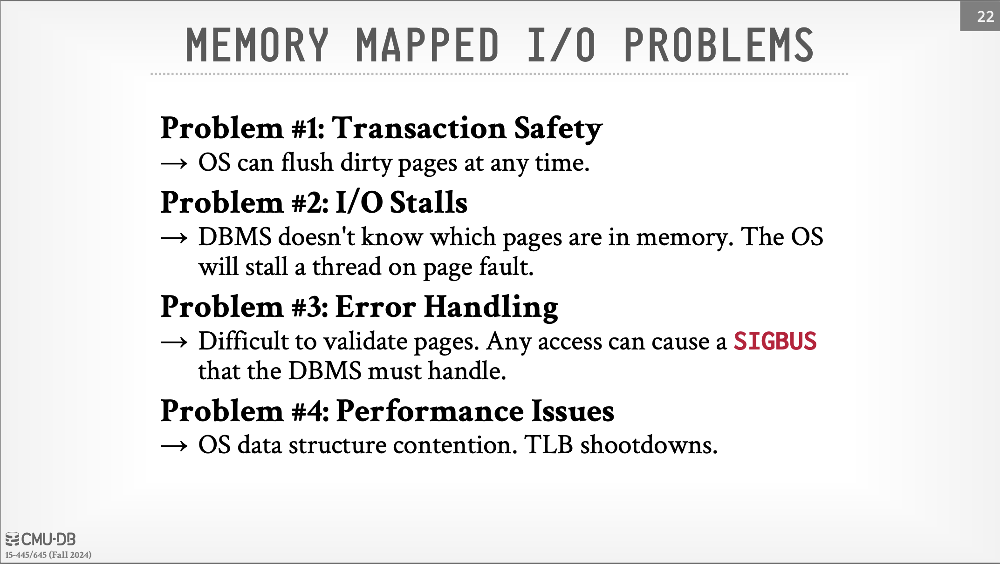
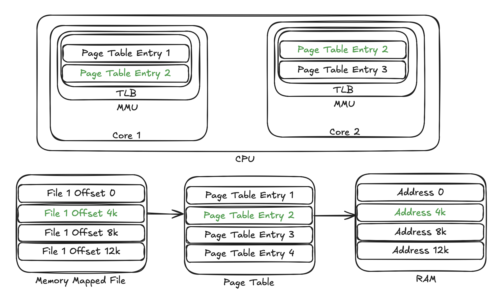
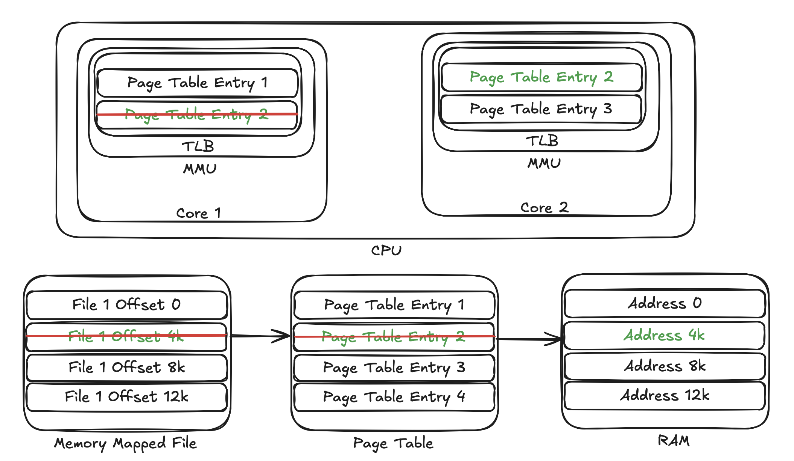
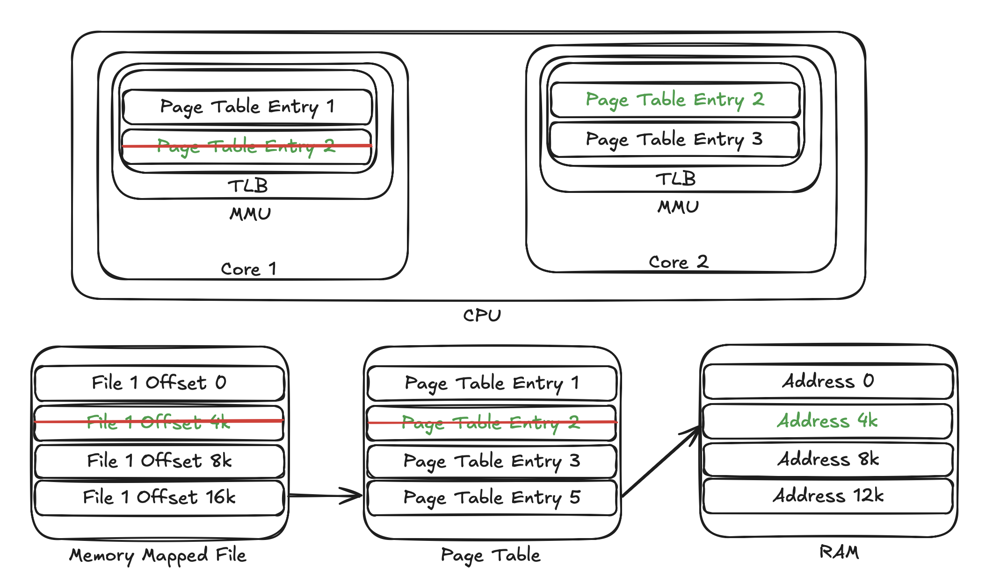
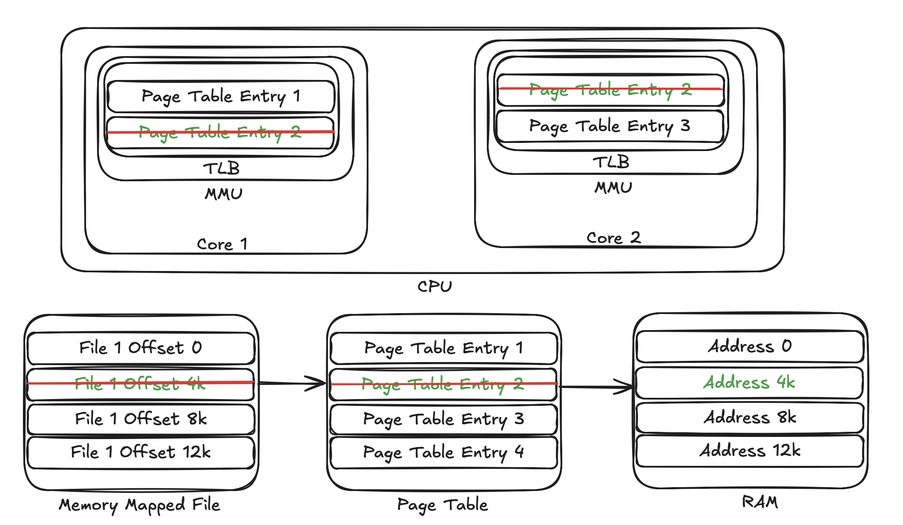

# Context
I was browsing the CMU's Database Systems course and found a reference to a paper
["Are You Sure You Want to Use MMAP in Your Database Management System?"](https://db.cs.cmu.edu/mmap-cidr2022/)
in the buffer pool [lecture slides](https://15445.courses.cs.cmu.edu/fall2024/slides/06-bufferpool.pdf).
Slide #22 mentioned [four problems with memory mapping (mmap)](docs/cmu-db-bufferpool-slide22.png),
and the fourth problem, the performance issues, triggered my curiosity.
 Memory Mapped I/O Problems in Slide #22

This repository is an attempt to reproduce the performance issues with using [mmap](https://en.wikipedia.org/wiki/Mmap).

# Back to Basics
Modern CPUs have 64-bit address buses and can [address 2^64 = 16 EB](https://en.wikipedia.org/wiki/64-bit_computing#Limits_of_processors)
memory locations. However, laptops and desktops have significantly less RAM than the 16 EB limit;
16 or 32 GB RAMs are the most common. How do programs access 16 EB memory using 32 GB of RAM?

RAM is the physical memory, and programs can only access the maximum memory equal to the available RAM
at any given time. The operating system, together with the hardware, does the magic behind the scenes to
transparently make available the 16 EB of address space to programs. MMU ([Memory Management Unit](https://en.wikipedia.org/wiki/Memory_management_unit))
is the hardware that handles the logical to physical memory mappings. To perform the address translation,
MMU accesses the page table managed by the operating system. The page table is a data structure managed
by the Kernel to keep track of the different segments of files mapped in memory.

The MMU is in the CPU core, so accessing the page table in RAM would be expensive for every address
translation. Hence, MMU has a cache of page table entries to improve address translation performance.
The cache is the TLB (Translation Lookaside Buffer).

In the diagram below, four segments of files are memory-mapped to different locations in RAM. The page table entry #2 is
in the TLB of both the CPU cores.

 Page Table and CPU with multiple cores

## What happens after munmap call - without TLB Shootdowns
[munmap](https://en.wikipedia.org/wiki/Mmap) call deletes the memory mapping created by mmap. In the diagram below,
core #1 executed the munmap call and deleted the corresponding entry #2 from the page table and its TLB. After this
call, the segment of RAM occupied by the previously mapped memory region is available for reuse. In this case, the
page table entry #2 still exists in the core #2 that can access the unmapped (or remapped) region. This behavior is not desirable. 

 Deleted entries in TLB of Core 1 (Core that executed munmap) and the page table after munmap

## mmap after munmap
If the process calls mmap again (after munmap), then the Kernel may allocate the same RAM segment for a new file offset.
However, the TLB in core #2 still has the old entry that maps to the same RAM location; the core #2 can access the new
mapped region, thinking it is the old region, leading to invalid behavior.

 mmap after munmap used the same segment in the RAM

## TLB Shootdowns
The proper fix to this issue is the TLB Shootdown. The core that executes the munmap call interrupts other cores
using [inter-process interrupt](https://en.wikipedia.org/wiki/Inter-processor_interrupt) (IPI) to ask them to clear
their TLBs before returning from mmap call. The entire operation makes munmap quite expensive.

 Deleted entries in TLBs of all cores and the page table after TLB Shootdowns

This is the performance problem with mmap mention in ["Are You Sure You Want to Use MMAP in Your Database Management System?"](https://db.cs.cmu.edu/mmap-cidr2022/) paper.

# How to build and use the repo
This repository has three applications.
* com.sk.CreateDataFiles - Create data files with UUIDs and store them at different offsets.
* com.sk.MMapReader - Read the data files in multiple threads by memory mapping the files.
* com.sk.BufferPoolReader - Read the data files in multiple threads by copying the file content to in-memory buffers.

## Compile
`make compile`

## Create data files
`make cdf`

## Read UUIDs in data files using memory mapping
`make mr`

## Read UUIDs in data files using a buffer pool
`make br`

# Result

I am running on a desktop with 12 cores, 64 G RAM and swap space.
```
$ nproc
12
$ free -h
               total        used        free      shared  buff/cache   available
Mem:            62Gi       5.5Gi        53Gi       181Mi       4.5Gi        57Gi
Swap:           61Gi          0B        61Gi
```

## mmap reads
```
$ make mr
grep TLB /proc/interrupts
 TLB:      75544      72890      80224      93459      68575      69820      82296      72405      73059      98265      70087      68913   TLB shootdowns
mvn exec:java -Dexec.mainClass="com.sk.MMapReader" -Dexec.args="-p data/data- -nf 50000 -nt 12 -nr 100"
[INFO] Scanning for projects...
[INFO] 
[INFO] ------------------------< com.sk:tlbshootdowns >------------------------
[INFO] Building tlbshootdowns 1.0-SNAPSHOT
[INFO] --------------------------------[ jar ]---------------------------------
[INFO] 
[INFO] --- exec-maven-plugin:3.5.0:java (default-cli) @ tlbshootdowns ---
2025-05-25 16:36:46.567 [com.sk.MMapReader.main()] INFO  com.sk.Readers - Starting to read 50000 files in 12 threads
2025-05-25 16:36:46.612 [com.sk.MMapReader.main()] INFO  com.sk.Readers - Waiting 10 hours for all tasks to complete.
2025-05-25 16:36:47.397 [com.sk.MMapReader.main()] INFO  com.sk.Readers - Finished reading all files in 834.852868 millis
[INFO] ------------------------------------------------------------------------
[INFO] BUILD SUCCESS
[INFO] ------------------------------------------------------------------------
[INFO] Total time:  1.339 s
[INFO] Finished at: 2025-05-25T16:36:47-07:00
[INFO] ------------------------------------------------------------------------
grep TLB /proc/interrupts
 TLB:     100338      99230     103512     124694     101075      93413     109853      97957     102240     125901      95964      93145   TLB shootdowns
```

## Buffer reads
```
$ make br
grep TLB /proc/interrupts
 TLB:     100338      99230     103512     124726     101075      93416     109853      97957     102240     125901      95965      93145   TLB shootdowns
mvn exec:java -Dexec.mainClass="com.sk.BufferPoolReader" -Dexec.args="-p data/data- -nf 50000 -nt 12 -nr 100"
[INFO] Scanning for projects...
[INFO] 
[INFO] ------------------------< com.sk:tlbshootdowns >------------------------
[INFO] Building tlbshootdowns 1.0-SNAPSHOT
[INFO] --------------------------------[ jar ]---------------------------------
[INFO] 
[INFO] --- exec-maven-plugin:3.5.0:java (default-cli) @ tlbshootdowns ---
2025-05-25 16:36:52.692 [com.sk.BufferPoolReader.main()] INFO  com.sk.Readers - Starting to read 50000 files in 12 threads
2025-05-25 16:36:52.771 [com.sk.BufferPoolReader.main()] INFO  com.sk.Readers - Waiting 10 hours for all tasks to complete.
2025-05-25 16:36:53.344 [com.sk.BufferPoolReader.main()] INFO  com.sk.Readers - Finished reading all files in 656.987325 millis
[INFO] ------------------------------------------------------------------------
[INFO] BUILD SUCCESS
[INFO] ------------------------------------------------------------------------
[INFO] Total time:  1.149 s
[INFO] Finished at: 2025-05-25T16:36:53-07:00
[INFO] ------------------------------------------------------------------------
grep TLB /proc/interrupts
 TLB:     100396      99291     103580     124804     101141      93489     109901      98008     102306     125960      96041      93220   TLB shootdowns
```

The buffer read is almost 20% ((834.852868-656.987325)*100 / 834.852868 = 21) faster than the mmap read.

I am grepp'ing TLB in /proc/interrupts file before and after the program to get the number of TLB Shootdowns.
Notice the large number of TLB Shootdowns in case of reading files using mmap. The high number of TLB Shootdowns
contributes to the slowness.

# Finally
The essence of this exercise is that if you have a system using mmap and notice an unexplained performance issue,
monitor the number of TLB Shootdowns in /proc/interrupts file. If the growth in TLB Shootdowns is high,
this may cause slow performance.
